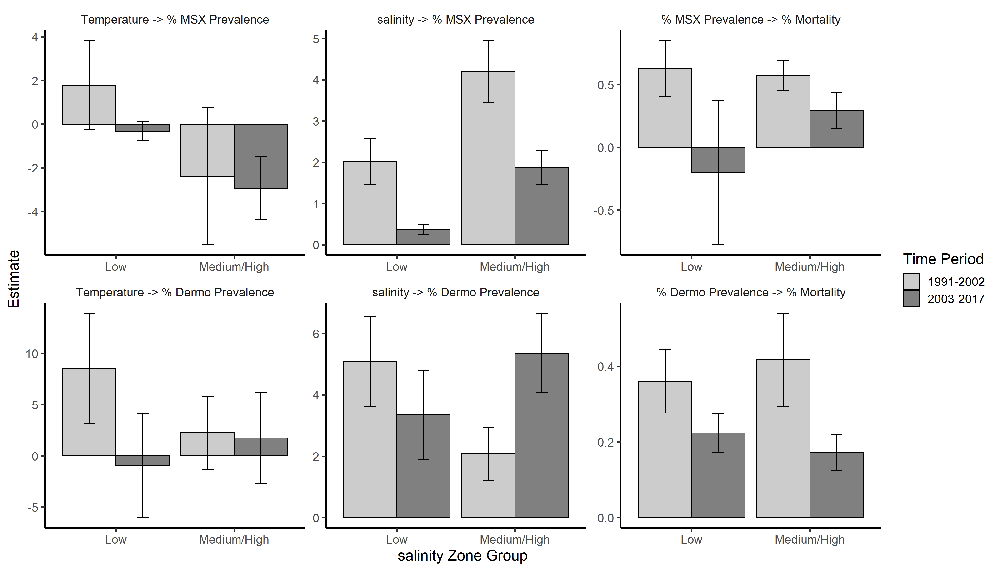

The oyster-environment-disease system in Chesapeake Bay, MD
================
Kathryn Doering, Michael Wilberg, Christopher Dungan, Carol M., and Mitchell Tarnowski
September 19, 2019

Project Description
-------------------

Oysters are ecosystem engineers and support a culturally and economically important fishery in Chesapeake Bay, Maryland. However, the oyster population is approximately only 2% of its historical abundance due to exploitation and the often lethal diseases, MSX and dermo.

The purpose of this project was to investigate the relationships between environmental conditions (captured by temperature and salinity), disease level (captured using prevalence), and oyster natural mortality rate and how these relationships may have changed over time. We found evidence that the relationships between disease level and natural mortality may have changed over time, which could indicate that oysters are developing resistance to MSX and potentially dermo.

This work was originally part of Kathryn Doering's master thesis.

Organization
------------

### ArcGIS

Maintain this under git? This could also be deleted if it is not necessary.

### Code

The code necessary to run the analyses are included in the `Code` directory. To run these scripts in the order they were created:

1.  Interpolate\_Salinity: Scripts used to interpolate the salinity and temperature data using Kriging and pull predictions at oyster bars of interest.
2.  Filter\_Kriging: Remove unreasonable predictions from the salinity and temperature kriging predictions.
3.  Summarize\_Disease: Manipulate the disease data to prepare it for use in structural equation modeling.
4.  SEM: Original structural equation modeling (SEM) analyses
5.  Create\_Figures: Scripts to make figures plotting results of the original SEM.
6.  PostThesis\_SEM: Analyses done after KD's thesis to address limitations of the original structural equation modeling approach.
7.  Explorations: These scripts were created at various times thoughout the project to explore small aspects, but do not contain the bulk of the work.

### Data

This has the original data used in the analysis.

TODO: figure out which data is used in the R code. If not used, delete the unnecessary data added.

Not needed: - CBF\_water\_qual was only used for some exploratory analyses, so don't really need to include

Need, but would prefer to upload in a simpler form: - BarInfo, DzData, SampleInfo, FallSurveyHalfBushel\_KD: MDDNR info. Maybe the best approach would be just to remove the unnecessary columns and resave (maybe save the orginals in a folder called "Raw\_Data"). Will need to chat with DNR folks about if these data can be online and if there is anything I should do about them.

-   CBP\_WQ\_Data\_18\_Sept\_2018 (could maybe write a script) instead to pull the data instead of adding the data itself to the repo? The dataset is quite large, otherwise.

### Derived Data and Figures

Should this be maintained under git?

### Results

